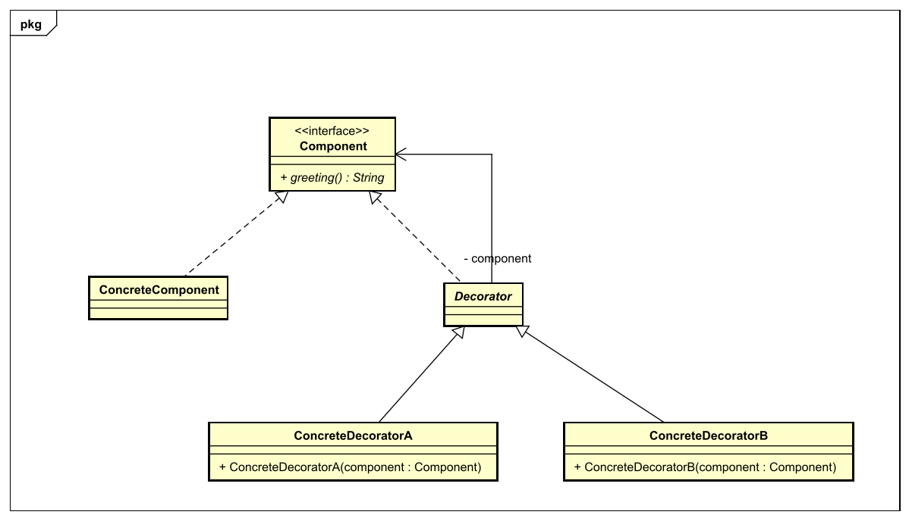

## Decorator-Pattern

### Problemdescription
Beim Decorator Pattern möchte man mit Dekorierer Klassen konkrete Komponenten einpacken und damit erweitert. Das Problem welches hier behandelt wird ist, dass man Klassen nicht modifizieren will, sondern erweitern möchte - mit Dekorierer Klassen.
### Context
Das Decorator Pattern basiert auf eine besondere Hierarchie, bei der ein Interface an oberster Stelle liegt, welches die Methodenköpfe bereitstellt, die von den Decorators und den Core-Elementen verwendet werden. Die Core-Elemente die konkreten Klassen, die die Methoden des Interfaces realisieren und die von den Decorators bessesen werden(HAS-A-Beziehung). Die Decorators sind nun dazu da, die Core-Elemente zu erweitern(zu "dekorieren").
Das Prinzip des Decorators ist, dass Klassen offen für Erweiterungen sein sollen, aber geschlossen für Veränderungen sein sollen.

### Solution
#### Design


#### Code

```java
	public class ConcreteComponent implements Component{
		@Override
		public String greeting(){
			return "Plain greeting"
		}
	}
```

```java
	public class ConcreteDecoratorA extends Decorator{
    	public ConcreteDecoratorA(Component component){
        	this.component=component;
    	}
    	@Override
    	public String greeting() {
        	return this.component.greeting()+" decorated with option A";
    	}
	}
```

```java
	public static void main(String[] args){
        // Decorator has-a component
		Component c = new ConcreteDecoratorA(new ConcreteComponent()); 
		System.out.println(c.greeting());
		//Output: Plain greeting decorated with option A
	}
```
### Quellen
* [Heads First](https://www.oreilly.com/library/view/head-first-design/0596007124/)