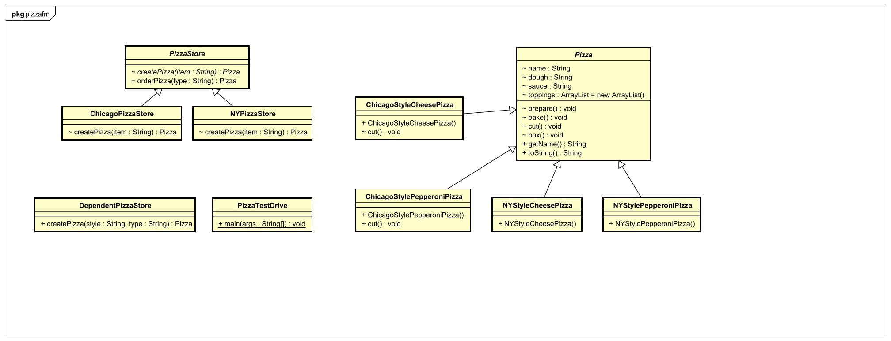
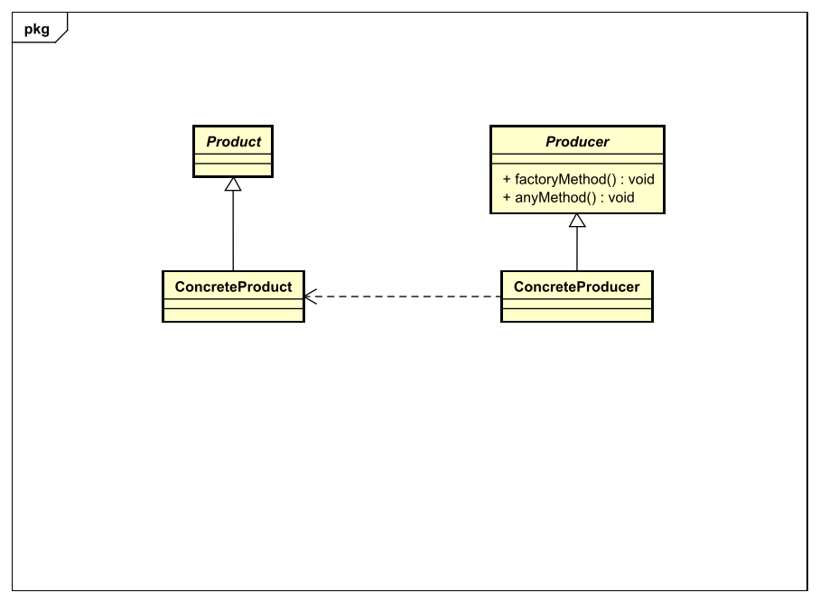

## Factory-Method-Pattern

### Problemdescription
Wie wir bei der Simple Factory erfahren haben, ist sie kein richtiges Design Pattern. Sie ist jediglich dazu da, die Instanzierung etwas nach hinten zu schieben. Ein weiteres Problem sind die Richtlinien, welche folgendes besagen:
* Keine Variable sollte eine Referenz auf eine konkrete Klasse halten 
* Keine Klasse sollte von einer konkreten Klasse abgeleitet sein
* Keine Methode sollte eine implementierte Methode einer ihrer Basisklassen überschreiben
Jedoch sind jene Richtlinien unmöglich in der Objekt-orientierten Programmierung einzuhalten.
### Context
Die Factory Method wird nun soweit erweitert, sodass nun Unterklassen entscheiden und die Instanzierung übernehmen. Die Instanzierung wird nun bei der Factory Method in die Unterklassen verschoben. Dadurch erhöht sich die Flexibilität des Codes und es gibt nun nicht nur eine einzige Factory, sondern beliebig viele Factories sind nun möglich. 
### Solution
#### Design

Vereinfacht


#### Code
Die abstrakte Klasse Pizza ändert sich nicht, da es sich schließlich noch um Pizzen handelt. 

```java
	public abstract class PizzaStore { //Pizzastore is abstract now
 	//producer
        abstract Pizza createPizza(String item);	//factory method

        public Pizza orderPizza(String type) {
            Pizza pizza = createPizza(type);
            System.out.println("--- Making a " + pizza.getName() + " ---");
            pizza.prepare();
            pizza.bake();
            pizza.cut();
            pizza.box();
            return pizza;
        }
    }
```

```java
	public class ChicagoPizzaStore extends PizzaStore {	//concrete producer

        Pizza createPizza(String item) {
                if (item.equals("cheese")) {
                        return new ChicagoStyleCheesePizza();
                } else if (item.equals("veggie")) {
                        return new ChicagoStyleVeggiePizza();
                }
```

```java
	public class ChicagoStyleCheesePizza extends Pizza {	//concrete product

        public ChicagoStyleCheesePizza() { 
            name = "Chicago Style Deep Dish Cheese Pizza";
            dough = "Extra Thick Crust Dough";
            sauce = "Plum Tomato Sauce";

            toppings.add("Shredded Mozzarella Cheese");
        }

        void cut() {
            System.out.println("Cutting the pizza into square slices");
        }
    }
```

### Quellen
* [Heads First](https://www.oreilly.com/library/view/head-first-design/0596007124/)