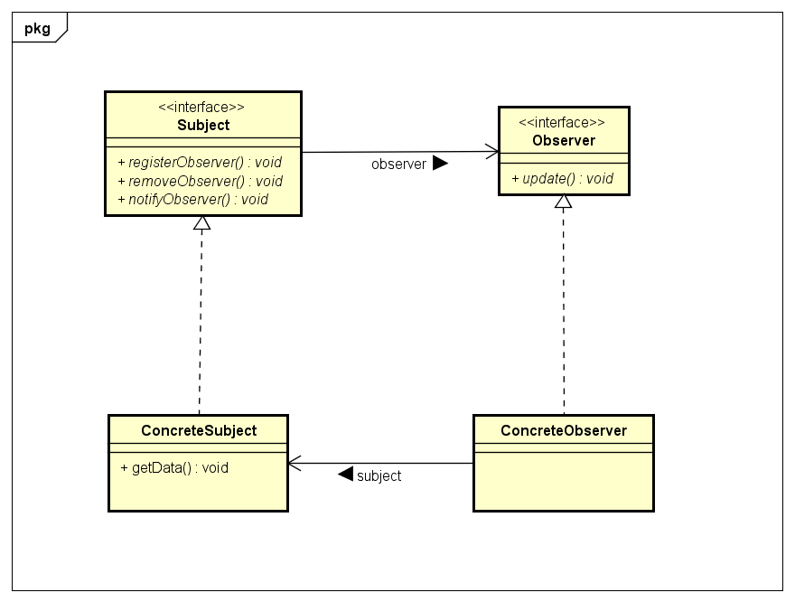

## Observer-Pattern

### Problemdescription
Im Observer Pattern möchte man die Objekte immer auf dem aktuellsten Stand halten. Nun möchte man aber mehrere Abonnenten verwalten und nicht jeden einzelnen Abonnent einzeln benachrichtigen. Dabei kommt das Observer Pattern ins Spiel.

### Context
Das Observer Pattern basiert grob gesagt auf 2 Interfaces - Subject und Observer. Man kann es sich besser mit dem Zeitungsbeispiel vorstellen: Das Subject Interface ist eine Zeitung und der Observer ist ein Kunde. Das Subject Interface stellt die Methoden zur Verwaltung der Abonnenten zur Verfügung, welche dann von einer konkreten Klasse implementiert werden. Das Observer Interface stellt die update Methode zur Verfügung, welche auch von konkreten Observer Klassen implementiert wird. Je nach push oder pull Prinzip hat die update Methode Parameter oder nicht.
Beim Observer Pattern strebt man nach dem Prinzip der losen Kopplung.

#### Unterschied push-pull
Die update Methode würde in der push Methode immer als Parameter angeben müssen, was aktualisiert wird, d.h. um sie hier für jeden Observer sinnvoll nutzen zu können, muss jeder Observer alle Messungen bekommen auch wenn sie nicht verwendet werden. In der pull Methode hat sie keine Parameter und bekommt alle benötigten aktualisierten Daten. Falls nun eine neue Information im konkreten Subject hinzugefügt wird, müsste diese im push Prinzip in jeder update Methode im Parameter hinzugefügt werden. Im pull Prinzip bekommt man alle Daten automatisch, da die Messwerte die man verwenden möchte, durch get-Methoden aus dem konkreten Subject bekommt. Daher kann jeder konkrete Observer auch die Daten bekommen, die er tatsächlich braucht und nicht immer alle.

### Solution
#### Design
Pull-Prinzip Observer

Anmerkung: getData hat als Rückgabetyp nicht void sondern, wie eine normale Getter-Methode, den Datentyp der Data selbst

#### Code
Im konkreten Observer wollen wir die neuesten Daten bekommen. Das passiert mithilfe der update Methode


```java
	/**
	 * Pull Method	
	 */
	public class ConcreteObserver implements Observer{
		private ConcreteSubject subject;
		private int data;			//for example: int
        public void update(){
            this.data = this.subject.getData();
        }
	}
```

```java
	/**
	 * Push Method	
	 */
	public class ConcreteObserver implements Observer{
		private ConcreteSubject subject;
		private int data;			//for example: int
        public void update(int data){
            this.data = data;
        }
	}
```

### Quellen
* [Heads First](https://www.oreilly.com/library/view/head-first-design/0596007124/)