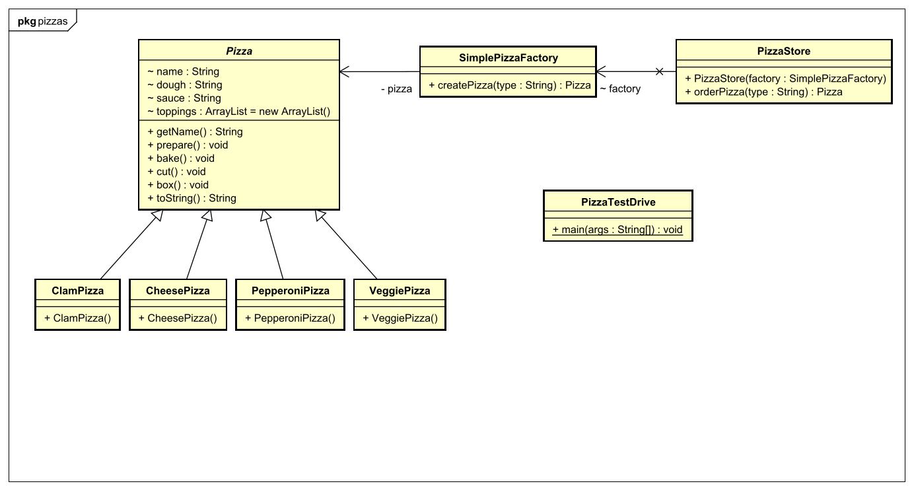

## Simple-Factory-Pattern

### Problemdescription
Wir wollen versuchen, die Instanzierung eines Objektes mit dem Schlagwort "new", so weit wie möglich nach hinten zu verschieben. Ein weiteres Problem der Simple Factory ist, dass sie eigentlich kein Design Pattern ist und gegen die Prinzipien verstößt. 
### Context
In der Simple Factory überlassen wir der Factory das Instanzieren der Objekte und eine abstrakte Klasse gibt an, was genau passieren soll mit den konkreten Objekten. 
### Solution
#### Design

#### Code

```java
	public class SimplePizzaFactory {

	public Pizza createPizza(String type) {
		Pizza pizza = null;

        if (type.equals("cheese")) {
            pizza = new CheesePizza();
        } else if (type.equals("pepperoni")) {
            pizza = new PepperoniPizza();
        }//usw...
        return pizza;
```

```java
	public class PizzaStore {
        SimplePizzaFactory factory;

        public PizzaStore(SimplePizzaFactory factory) { 
            this.factory = factory;
        }

        public Pizza orderPizza(String type) {
            Pizza pizza;

            pizza = factory.createPizza(type);

            pizza.prepare();
            pizza.bake();
            pizza.cut();
            pizza.box();

            return pizza;
        }
```

```java
	public static void main(String[] args){
		SimplePizzaFactory factory = new SimplePizzaFactory();
        PizzaStore store = new PizzaStore(factory);
        Pizza pizza = store.orderPizza("cheese");
        System.out.println("We ordered a " + pizza.getName() + "\n");
	}
```
### Quellen

* [Heads First](https://www.oreilly.com/library/view/head-first-design/0596007124/)